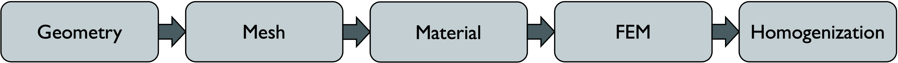
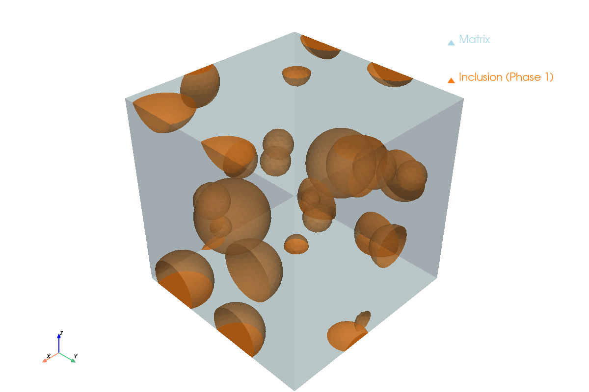
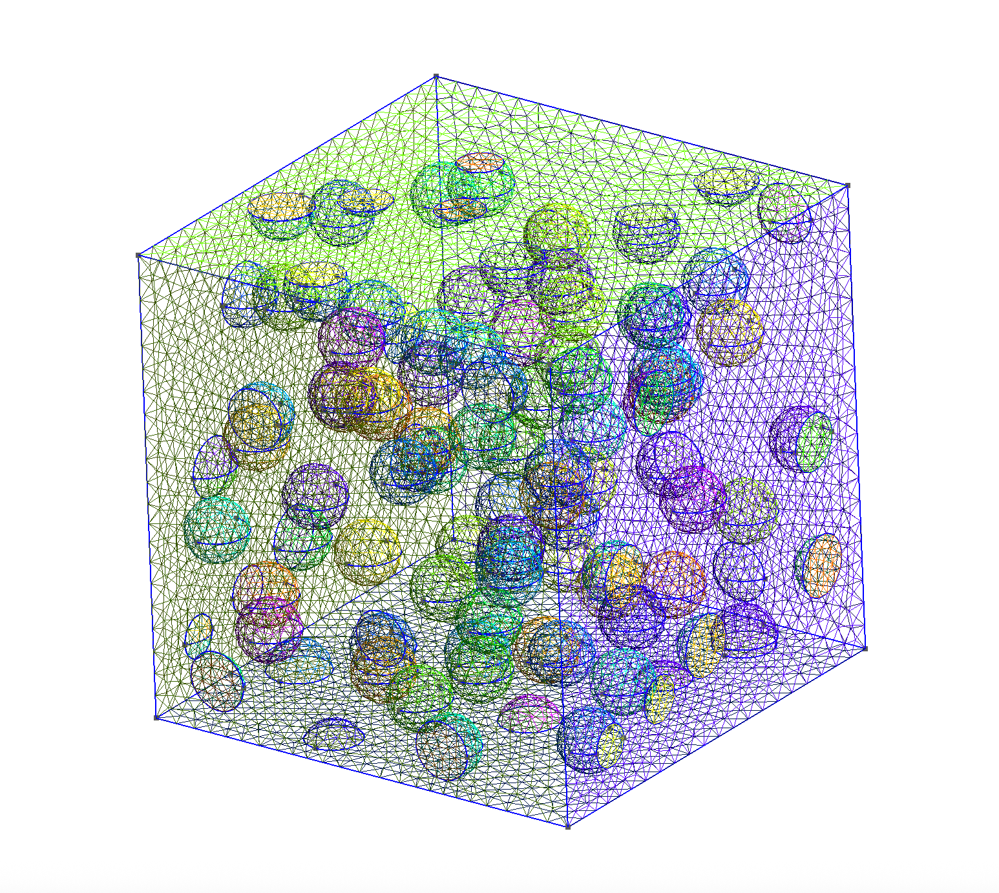
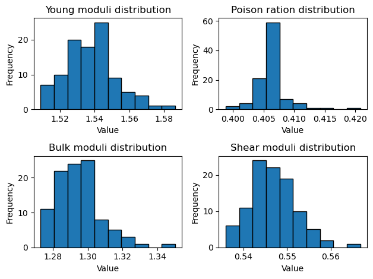

# HomiCSx

HomiCSx is short for [FEniCSx](https://fenicsproject.org)-based homogenization.

It is an open-source numerical homogenization software, inheriting the advantages that come with FEniCSx. HomiCSx is intended for researchers and engineers working on computational homogenization of heterogeneous materials using finite element methods.

## Feature list

- Generation of random periodic inclusion/void based geometries, including custom geometries of this type
- Usage of RSA algorithm for packing
- Supporting circular/spherical and elliptical/ellipsoidal inclusions in 2D/3D geometries
- Option for intersecting voids to mimic the structure of open-cell foams
- GMSH meshing backend, with support for tri/quad and tet/hex elements
- Automatic tagging of cells and facets
- Multi-phase material assignment
- Prebuilt linear and capability of writing custom nonlinear material classes by inheriting from the abstract nonlinear material class
- Ability to inherit from the hyperelastic and viscoelastic base material classes to create custom nonlinear materials of such types
- Capability of assigning different material types to different phases
- Tracking of material states in time-history-dependent problems at integration points
- Automatic linear and nonlinear formulation of the periodic fluctuation problem
- Automatic handling of periodic boundary conditions via MPCs
- Usage of dolfinx nonlinear solver tailored for MPC problems
- Built-in adaptive stepping nonlinear solver, with full control over solver hyper-parameters
- Linear and nonlinear homogenization via built-in and custom load cases
- Customizable homogenization procedure via 7 callable hook entry points during the homogenization process
- Output load/time history data and Jacobian/energy/PK1/tangent graphs against load history in nonlinear homogenization
- Ability to export XDMF files for Paraview post processing
- Simple stochastic utilities for linear homogenization, including ensemble study of similar microstructures, and volume-fraction/stiffness ratio sweep utilities

## Introduction

It is made to be completely modular, including the:

<div align="center">
    
</div>

- Geometry module: Using numpy and pure python to generate the corresponding geometry of the homogenization problem. It is stochastic in nature, able to generate random periodic geometries based on the input geometry attributes. Currently, the module is able to produce mono/poly disperse 2D/3D geometries consisting of circular/elliptical 2D and spherical/spheroidal 3D and random periodic geometries. It can be encorporated for generation of both inclusion and void based geometries. It uses the RSA algorithm for the packing process. It can also be used to generated custom inclusion/void based geometries. The module also supports geometries containing interphase layer/coated inclusions.

<div align="center">
    
</div>

- Mesh module: The mesh module utilizes `gmsh` to generate the mesh, facet tags, and cell tags. It supports tri/quad elements for 2D meshes and tet/hex for 3D meshes.

<div align="center">
    
</div>

- Material module: The material module supports both linear elastic and nonlinear materials. It has base classes for hyperelastic and viscoelastic materials, which can be utilized to define custom material classes. It currently only supports the generalized maxwell model as the viscoelastic material base class. It also supports state management for history-dependant problems, such as viscoelastic homogenization problems.

- FE module: The module is mainly responsible for formulation of the linear/nonlinear fluctuation problem, accounting for the necessary DBCs and MPCs for a fully periodic homogenization problem. 

- Homogenization module: The homogenization module is responsible for the homogenization process itself. In the linear case, it uses the 6 load-case homogenization loop to calculate the homogenized stiffness tensor and the effective moduli. For nonlinear problems, it reports the behavior of the unit-cell under different load-cases (pre-made or custom), and provides the summary of the analysis and the corresponding behavioral graphs. The homogenization loop is customizable and extensible via a "hook" mechanism. It incorporates callables at certain entries inside the homogenization loop for this purpose. 

<div align="center">
    
</div>

<div align="center">
    
</div>

<div align="center">
    
</div>

- Stochastic module: It contains a few small functions that can be used for some simple linear stochastic analyses. Currently, it supports study of ensemble of similar random cases with similar geometrical attributes, a linear volume fraction sweep study utility, and a linear stiffness ration sweep study utility.

<div align="center">
    
</div>

<div align="center">
    
</div>

<div align="center">
    
</div>

<div align="center">
    
</div>

<div align="center">
    
</div>

## Documentation
The documentation can be viewed [here](https://homicsx.readthedocs.io/en/latest/)

## Installation guide

HomiCSx is currently only accessible via installation from source.

HomiCSx has been tested on macOS with Apple silicon chips. Since it uses dolfinx and dolfinx_mpc as backbone, it is currently only available on macOS and Linux. For windows, WSL2 is recommended.

It is recommended to use [conda](https://docs.conda.io/en/latest/) environments for the installation. An `environment.yml` file, including the versioned dependencies is provided in the repo, which can be directly use to prepare an environment which is ready to be used for HomiCSx installation. To do this, simply do:

```bash
conda env create -f environment.yml
conda activate homicsx_env
```

By doing so, a ready-to-use environment with all of the prerequisites installed named `homicsx_env` will be created.

Then, clone the repository:

```bash
git clone https://github.com/AmirTahouni/HomiCSx.git
cd homicsx
```

And lastly, use `pip install` while in the `homicsx_env` environment at the repository root to install HomiCSx from source:

```bash
pip install -e .
```

For a source installation such as HomiCSx, editable mode is convenient because users can pull updates without reinstalling.

To verify the installation, run:

```bash
python -c "import homicsx; print('HomiCSx imported successfully.')"
```

Note that HomiCSx has only been tested with the provided versions of the dependencies. Using other versions may work, but is not supported.

## Authors
- Amir Reza Tahouni (tahouniamirreza@gmail.com)