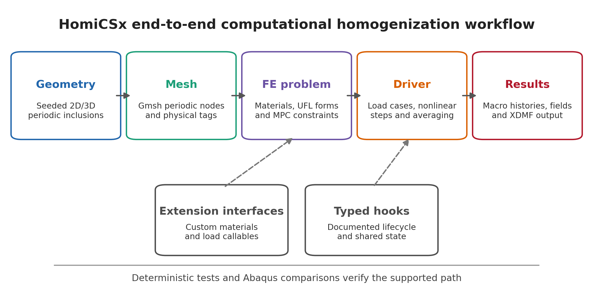
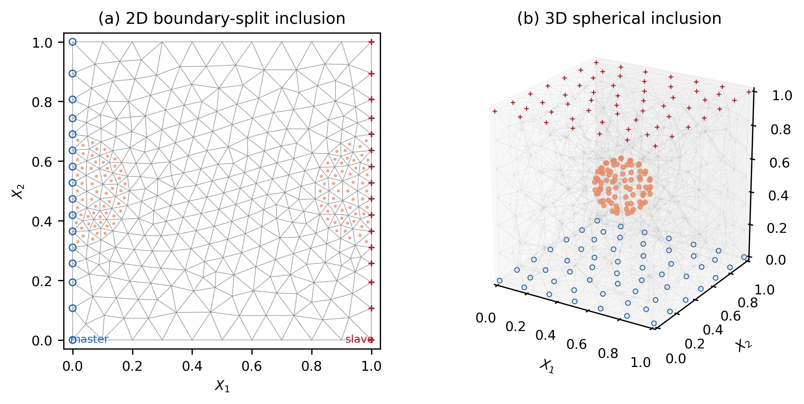
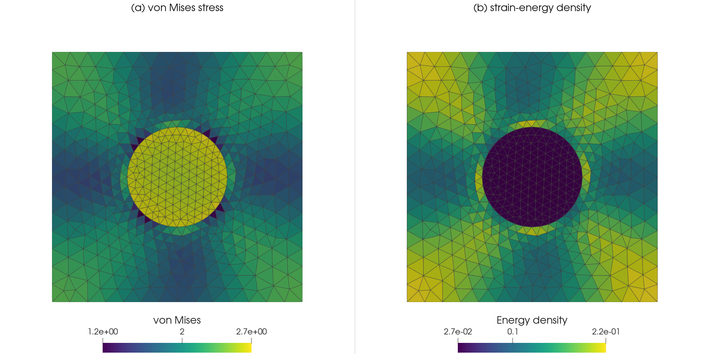

# HomiCSx

HomiCSx is an open-source Python framework for first-order finite-element
computational homogenization on FEniCSx. It connects particulate geometry,
periodic-conforming Gmsh meshing, material assignment, linear and finite-strain
periodic problems, homogenization, hooks, and essential output in one
reproducible workflow.

<p align="center">
  
</p>

## Supported core

- Seeded periodic RSA generation for monodisperse or polydisperse circles,
  spheres, axis-aligned ellipses, and axis-aligned ellipsoids.
- Explicit construction of custom particulate cells, including rotated
  ellipses and ellipsoids and coated/interphase inclusions.
- Periodic-conforming Gmsh meshes with phase and boundary tags. Triangles,
  tetrahedra, and tested 2D all-quadrilateral meshes are supported; general 3D
  hexahedral generation is not.
- Multiphase small-strain linear elasticity and finite-strain homogenization.
- A built-in compressible isotropic Neo-Hookean model, plus user-defined
  hyperelastic materials through UFL strain-energy functions and matching
  numerical post-processing methods.
- A finite-strain generalized-Maxwell material with state management.
- Built-in and custom load histories, adaptive stepping, typed hooks, and
  macroscopic stress, energy, Jacobian, and tangent histories.
- XDMF output suitable for ParaView.

<p align="center">
  
</p>

The higher-level `homicsx.stochastic` convenience functions and
`homicsx.visualization` helpers are experimental and excluded from the
publication-supported API.

## Geometry scope

The random generators use periodic random sequential adsorption and explicitly
store the periodic images needed for boundary-crossing particles. Random
ellipses and ellipsoids are currently axis-aligned because independent random
orientations require a validated orientation-aware collision and clearance
algorithm. For prescribed geometries, `Inclusion.orientation` supports a 2D
angle or three 3D XYZ rotation angles.

The generator reports nominal volume fraction from original particles. For
overlapping/open-cell constructions, the current correction is approximate;
that workflow is outside the publication-supported core.

## Parallel execution

The release gate runs the complete linear periodic workflow on two MPI ranks,
including distributed mesh conversion, multipoint constraints, solves, and
global stress/volume reductions. Nonlinear hyperelastic and generalized-Maxwell
two-rank trials currently terminate with a PETSc segmentation fault during the
nonlinear multipoint-constraint solve, including when a distributed
Krylov/block-Jacobi configuration is used.
Consequently, nonlinear MPI execution is **not supported** in this release.
Run nonlinear workflows on one MPI rank.

This is a functional MPI smoke test, not a scalability claim.

## Installation

HomiCSx 1.0.0 is tested on Linux, including Linux under WSL2, with Python 3.10,
DOLFINx 0.9.0, and `dolfinx_mpc` 0.9.0. The versioned Conda environment is the
authoritative dependency specification.

```bash
git clone https://github.com/AmirTahouni/HomiCSx.git
cd HomiCSx
conda env create -f environment.yml
conda activate homicsx_env
python -m pip install --no-deps -e .
python -c "import homicsx; print(homicsx.__version__)"
```

Other dependency versions and native Windows/macOS installations may work but
are outside the current verification matrix.

## Tested example

This compact end-to-end example is exercised by the test suite and can be run
from a source checkout:

```bash
python examples/linear_periodic_2d.py
```

The [`examples/`](examples/) directory contains deterministic, non-interactive
linear, hyperelastic, viscoelastic, and MPI workflows. They are the single
maintained entry point for runnable examples; the documentation provides the
corresponding narrative tutorials.

<p align="center">
  
</p>

## Verification and documentation

The [verification documentation](docs/source/validation.md) summarizes
analytical tests, mesh-refinement gates, the MPI smoke test, and independent
Abaqus comparisons based on conventional macroscopic stress, strain, energy,
Jacobian, and stiffness measures. Application-specific local-tail metrics are
deliberately excluded.

- [Documentation](https://homicsx.readthedocs.io/en/latest/)
- [Abaqus comparison suite](validation/abaqus/README.md)
- [Supported API](PUBLIC_API.md)
- [Support and maintenance policy](SUPPORT.md)
- [Contributing guide](CONTRIBUTING.md)
- [Citation metadata](CITATION.cff)

## Author and license

HomiCSx is developed by Amir Reza Tahouni
(tahouniamirreza@gmail.com) and distributed under the MIT License.
