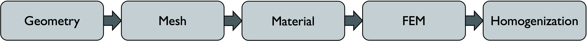
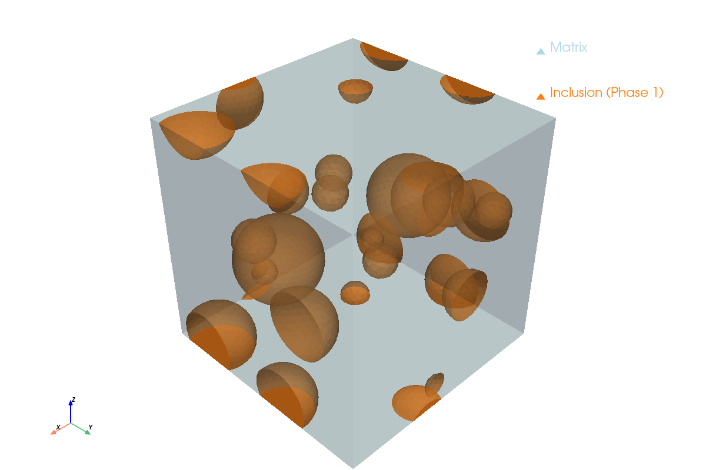
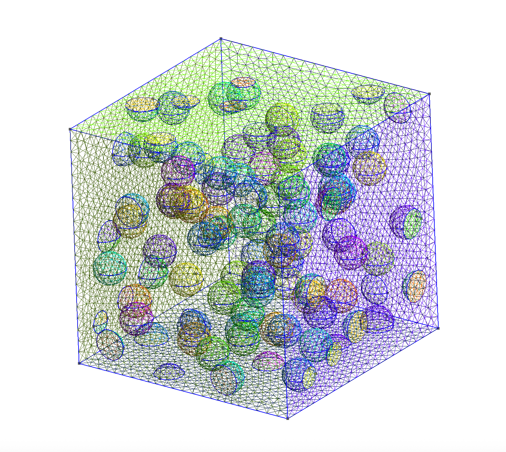
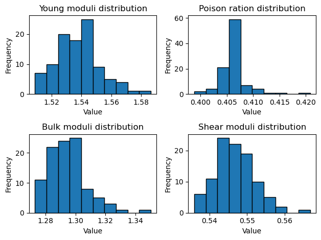

# HomiCSx

HomiCSx is short for [FEniCSx](https://fenicsproject.org)-based homogenization.

It is an open-source numerical homogenization software, inheriting the advantages that come with FEniCSx. HomiCSx is intended for researchers and engineers working on computational homogenization of heterogeneous materials using finite element methods.

## Feature list

- Generation of random periodic particulate geometries with a reproducible RSA-based workflow
- Gmsh-based periodic-conforming meshing with automatic cell and facet tagging
- Multi-phase material assignment
- Built-in isotropic linear-elastic and Neo-Hookean material models
- Extensible nonlinear material models through the public material interface
- Automatic linear and nonlinear formulation of the periodic fluctuation problem
- Automatic handling of periodic boundary conditions via MPCs
- Nonlinear solution with adaptive load stepping and configurable solver parameters
- Linear and nonlinear homogenization via built-in and custom load cases
- Customizable homogenization procedures through callable hook entry points
- Macroscopic stress, strain, energy, and tangent response histories
- Ability to export XDMF files for Paraview post processing

The `homicsx.stochastic` and `homicsx.visualization` modules are experimental.
They are not part of the publication-supported API and may change or be removed
in a future release.

## Introduction

It is made to be completely modular, including the:

<div align="center">
    
</div>

- Geometry module: Using numpy and pure python to generate the corresponding geometry of the homogenization problem. It is stochastic in nature, able to generate random periodic geometries based on the input geometry attributes. Currently, the module is able to produce mono/poly disperse 2D/3D geometries consisting of circular/elliptical 2D and spherical/spheroidal 3D and random periodic geometries. It can be encorporated for generation of both inclusion and void based geometries. It uses the RSA algorithm for the packing process. It can also be used to generated custom inclusion/void based geometries. The module also supports geometries containing interphase layer/coated inclusions.

<div align="center">
    
</div>

- Mesh module: The mesh module uses `gmsh` to generate the mesh, facet tags, and cell tags. By default, opposite RVE boundaries receive matching node patterns through Gmsh periodic constraints. Set `MeshSettings(periodic_mesh=False, ...)` only when a legacy nonmatching mesh is intentionally required. Triangular and tetrahedral meshes form the publication-supported path; forced quad/hex meshing remains experimental.

<div align="center">
    
</div>

- Material module: The material module supports both linear elastic and nonlinear materials. It has base classes for hyperelastic and viscoelastic materials, which can be utilized to define custom material classes. It currently only supports the generalized maxwell model as the viscoelastic material base class. It also supports state management for history-dependant problems, such as viscoelastic homogenization problems.

- FE module: The module is mainly responsible for formulation of the linear/nonlinear fluctuation problem, accounting for the necessary DBCs and MPCs for a fully periodic homogenization problem. 

- Homogenization module: The homogenization module is responsible for the homogenization process itself. In the linear case, it uses the 6 load-case homogenization loop to calculate the homogenized stiffness tensor and the effective moduli. For nonlinear problems, it reports the behavior of the unit-cell under different load-cases (pre-made or custom), and provides the summary of the analysis and the corresponding behavioral graphs. The homogenization loop is customizable and extensible via a "hook" mechanism. It incorporates callables at certain entries inside the homogenization loop for this purpose. 

<div align="center">
    
</div>

<div align="center">
    
</div>

<div align="center">
    
</div>

- Experimental modules: The current stochastic convenience functions and visualization helpers are retained for compatibility and evaluation, but are not included in the supported publication scope. See the experimental-features documentation before using them.

<div align="center">
    
</div>

<div align="center">
    
</div>

<div align="center">
    
</div>

<div align="center">
    
</div>

<div align="center">
    
</div>

## Documentation
The documentation can be viewed [here](https://homicsx.readthedocs.io/en/latest/)

Compact, non-interactive examples that are exercised by the test suite are in
[`examples/`](examples/). The notebooks in [`demos/`](demos/) provide longer
narrative walkthroughs.

## Installation guide

HomiCSx is currently only accessible via installation from source.

HomiCSx 1.0.0 is tested on Linux with Python 3.10, DOLFINx 0.9.0, and
`dolfinx_mpc` 0.9.0. On Windows, use WSL2. Other environments, including
macOS, may work but are outside the current tested support envelope.

Clone the repository, then use its versioned Conda environment specification:

```bash
git clone https://github.com/AmirTahouni/HomiCSx.git
cd HomiCSx
conda env create -f environment.yml
conda activate homicsx_env
```

By doing so, a ready-to-use environment with all of the prerequisites installed named `homicsx_env` will be created.

Then install HomiCSx itself from the repository root:

```bash
python -m pip install --no-deps -e .
```

The Conda environment is the authoritative dependency specification;
`--no-deps` prevents `pip` from attempting to replace the compiled FEniCSx,
PETSc, and MPI stack. Editable mode is convenient for a source checkout.

To verify the installation, run:

```bash
python -c "import homicsx; print(homicsx.__version__)"
```

Note that HomiCSx has only been tested with the provided versions of the dependencies. Using other versions may work, but is not supported.

## Validation, citation, and support

The [validation suite](validation/abaqus/README.md) compares conventional
macroscopic energy, stress, and volume-change measures against geometry-matched
Abaqus reference analyses. Local-tail metrics used in application research are
deliberately excluded from package verification.

Citation metadata is provided in [`CITATION.cff`](CITATION.cff). See
[`SUPPORT.md`](SUPPORT.md) for the maintenance policy and
[`CONTRIBUTING.md`](CONTRIBUTING.md) for contribution guidance. The supported
surface and compatibility rules are defined in [`PUBLIC_API.md`](PUBLIC_API.md).

## Quickstart

The code provided below performs an end-to-end linear homogenization analysis, from geometry generation to post-processing.

```python
from homicsx import GeometryInput, PhysicalTags, MeshSettings, LinearElasticIsotropic, MaterialAssignment, ProblemSettings, particulate_geometry_generator, generate_mesh, LinearHomogenizationDriver
import numpy as np

# Create geometry data object and generate the geometry
geometry_input = GeometryInput(
    dim=2,
    dispersion="mono",
    volume_fraction=0.05,
    num_particles=100,
    clearance=0.015,
    domain_size=(1, 1),
    shape="circle",
    seed=42
)
geometry = particulate_geometry_generator(geometry_input)

# Initiate the physical-tagging convention
physical_tags = PhysicalTags()

# Create mesh data object and generate mesh, cell tags, and facet tags
mesh_settings = MeshSettings(
    min_size=0.01,
    max_size=0.02,
    physical_tags=physical_tags,
)
mesh, ct, ft = generate_mesh(
    geometry=geometry,
    mesh_settings=mesh_settings,
)

# Create material assignment
material_assignment = MaterialAssignment(
    materials_by_phase={
        0: LinearElasticIsotropic(young_modulus=1.0, poisson_ratio=0.2),
        1: LinearElasticIsotropic(young_modulus=10.0, poisson_ratio=0.2),
    }
)

# Create problem definition data object
problem_settings = ProblemSettings(
    dim = geometry_input.dim,
    kinematics='small_strain',
    two_dimensional_formulation='plane_strain',
    element_family='Lagrange',
    element_degree=1
)

# Initiate the linear driver and solve the homogenization problem
driver = LinearHomogenizationDriver(
    mesh_obj=mesh,
    cell_tags=ct,
    facet_tags=ft,
    assignment=material_assignment,
    settings=problem_settings,
    physical_tags=physical_tags,
    domain_size=geometry_input.domain_size,
    matrix_phase_id=0
)
result = driver.run()

# Post-processing
print("C_hom: ")
with np.printoptions(suppress=True, precision=3):
    print(result.C_hom)

# OUTPUT:
#
# C_hom: 
# [[ 1.186  0.297 -0.   ]
#  [ 0.297  1.186 -0.   ]
#  [-0.    -0.     0.444]]
```


## Authors
- Amir Reza Tahouni (tahouniamirreza@gmail.com)
